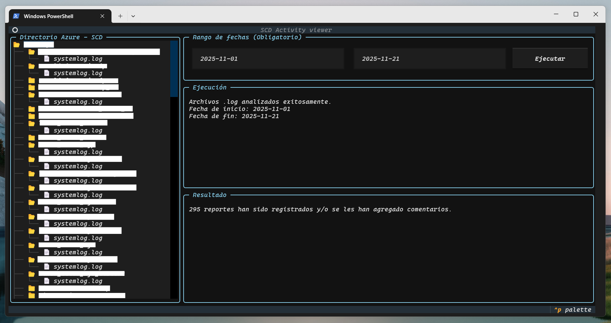

# Azure Log Viewer



Azure Log Viewer is a terminal-based Textual application for browsing Azure File Share
directories and analyzing `.log` files within a user-defined date range.

The tool is designed for internal operational use, providing a fast and interactive way
to inspect log activity without leaving the terminal.

---

## Features

- Interactive TUI built with Textual
- Azure File Share directory navigation
- Date range filtering for log analysis
- Asynchronous log processing (non-blocking UI)
- Aggregated reporting of log activity

---

## Requirements

- Python 3.12 or higher
- Access to the target Azure File Share
- Azure storage account credentials

---

## Installation

### Using [uv](https://docs.astral.sh/uv/getting-started/installation/) (recommended) on macOS, Linux, and Windows.

```bash
uv tool install git+https://github.com/Fabrizioel/azure_storage_log_viewer.git
```

---

## Usage

### Run the application from any terminal:

```bash
azure-log-viewer
```

The application will prompt for credentials, then present an interactive interface for directory browsing and log analysis.

---

## Development

### Clone the repository and install in editable mode:
```bash
pip install -e .
python -m azure_log_viewer
```

---

## How the Tool Works

Once launched, Azure Log Viewer guides the user through a simple, linear workflow:

1. **Load Azure File Share credentials**  
   The user provides the Azure Web Storage credentials required to access the target File Share.  
   These credentials are used only to establish a read connection to the storage account.

2. **Load and display the Azure directory tree**  
   After authentication, the application retrieves and displays the directory structure of the Azure File Share.  
   The user waits until the directory tree is fully loaded before proceeding.

3. **Define a date range**  
   The user inputs a start date and an end date.  
   This date range is mandatory and determines which log files will be analyzed.

4. **Scan log files**  
   The application searches the currently loaded directory tree for `systemlog.log` files and evaluates them within the specified date range.

5. **Process and analyze logs**  
   The matching log files are analyzed asynchronously to avoid blocking the interface.

---

## Output and Results

After processing completes, the application returns:

- The total number of `systemlog.log` files discovered in the selected directory tree
- The number of reports that:
  - have been created, and/or
  - have had comments added to them within the specified date range

The results are displayed directly in the interface once analysis is complete.

---

### Notes

- The application does not modify any files in Azure storage.
- All processing is read-only and performed locally.
- Execution time depends on the number of directories and log files present in the File Share.